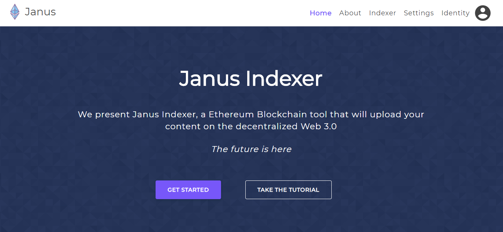

# Janus Indexer Dapp

Indexer front-end is an interface that allows the user content in the blockchain and attach it in the Janus system.

The indexer front end helps to publish and index the websites. Publish in the IPFS and return the valid hash or validate the IPFS hash entered and index the informations on the Janus platform.




## Featured Technologies

Vue: Is a progressive framework for building user interfaces.

Web3: Web3 is a collection of libraries which allow you to interact with a local or remote ethereum node, using a HTTP or IPC connection.

Yarn: Is a package manager for javascript

## Prerequites

### Windows users only
Configure web3 following the instructions in this [page](https://medium.com/@jcbombardelli/configurando-web3-em-um-projeto-node-js-com-windows-984ca1224fa) (in Portuguese).

## Installation


``` bash
# install dependencies
yarn install
```

## Usage

This package requires `@4cadia/janus-indexer-core`, which is located in the `./packages/indexer-core` directory of this repository.

```
# Go to the indexer-core folder
cd ../indexer-core

# Run
yarn build

# Come back to this package directory
cd ../indexer-dapp

# serve with hot reload at localhost:8080
yarn dev
```

### Build for production
```
# Run
yarn build
```

## Run Tests

```bash

# run unit tests
yarn test:unit

```

```bash
# run all tests
yarn test
```

## Other Commands

``` bash
# run code linter
yarn lint

```

``` bash
# automatically fixes issues found by linter
yarn lint-fix

```

## Contributing

1. Fork it (<https://github.com/4cadia-foundation/janus/fork>)
2. Create your feature branch (`git checkout -b feature/fooBar`)
3. Commit your changes (`git commit -am 'Add some fooBar'`)
4. Push to the branch (`git push origin feature/fooBar`)
5. Create a new Pull Request

<!-- Markdown link & img dfn's -->
[npm-image]: https://img.shields.io/npm/v/datadog-metrics.svg?style=flat-square
[npm-url]: https://npmjs.org/package/datadog-metrics
[npm-downloads]: https://img.shields.io/npm/dm/datadog-metrics.svg?style=flat-square
[travis-image]: https://img.shields.io/travis/dbader/node-datadog-metrics/master.svg?style=flat-square
[travis-url]: https://travis-ci.org/dbader/node-datadog-metrics
[wiki]: https://github.com/yourname/yourproject/wiki


